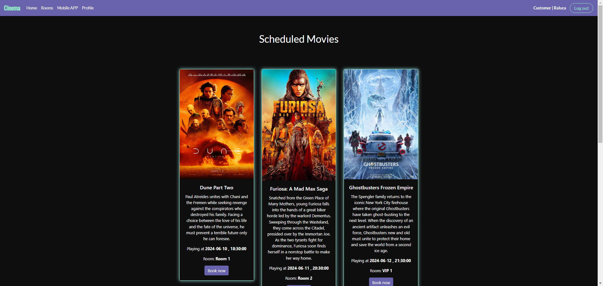
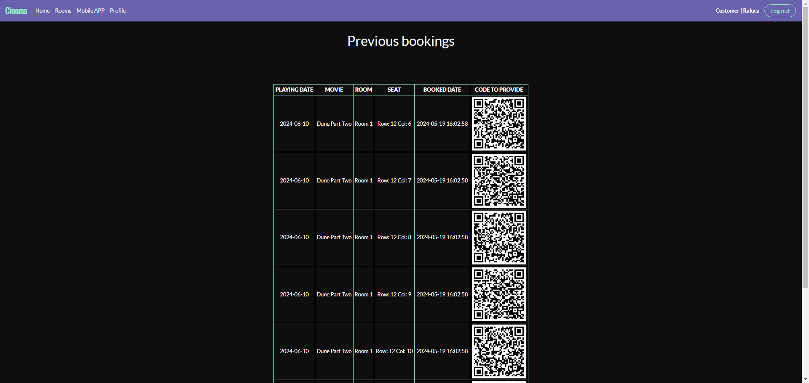
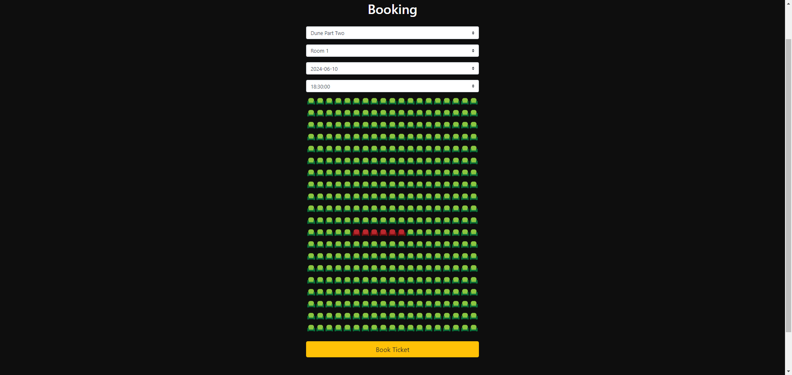
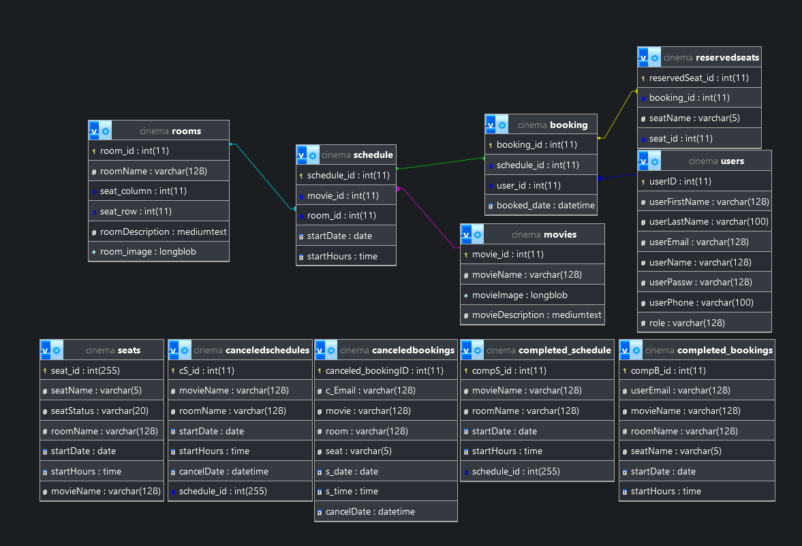

# Cinema Panel

## Description

This is a simple cinema panel that allows you to add, edit, delete and view movies, select seats and more. It is built
using PHP, MySQL, Composer and Bootstrap.

## Features

- Add, edit, delete and view movies
- Admin panel for managing movies
- User panel for selecting seats
- QR code generation for selected seats (using `bacon/bacon-qr-code`)

## Installation

1. Clone the repository
2. Run `composer install`
3. Import the `cinema.sql` file into your database
4. Update the database credentials in `config.php`
5. Run the application
6. Login to the admin panel using the default credentials (username: `tory`, password: `admin`)
7. Add movies and start managing tickets!

## Screenshots

### home

### profile

### rooms

### ticket

### bookings

### create movie

## Database Schema

The database schema is as follows:

